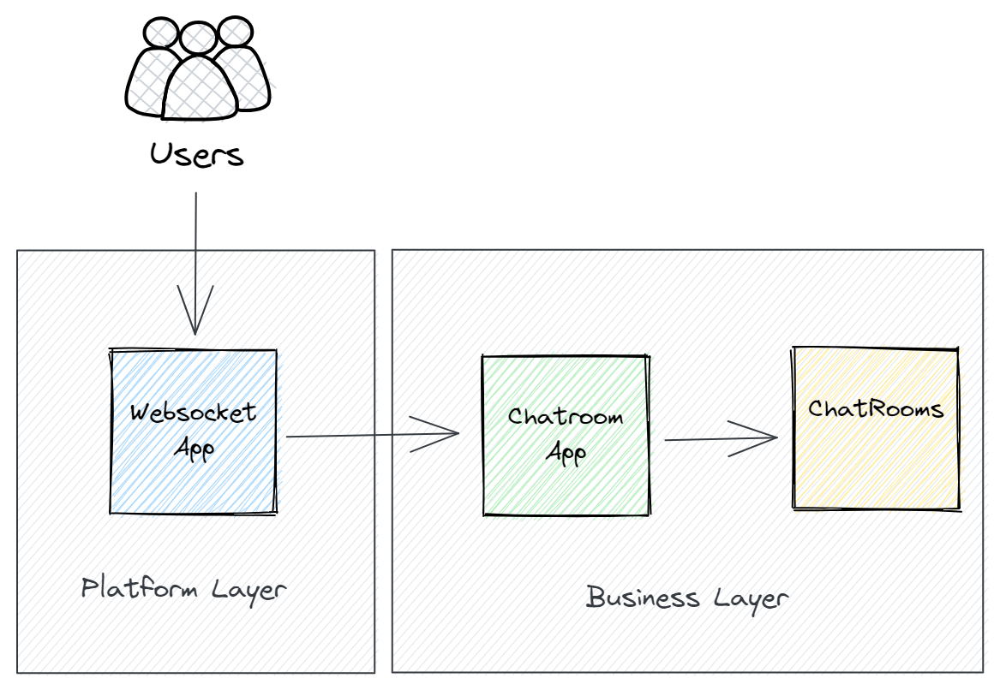

# Chatty

Chatty is a web service for chat rooms built with Go.

## Why?

This project is made mainly for learning purposes. I wanted to practice websockets and goroutines in Go.
In order to do that, I decided to build a simple chat room service.

## Is it production ready?

No. This project is not production ready. Although it is completely functional it lacks of 
authentication, authorization and instrumentation. From scalability perspective, the rooms
live as long as the chat service is running. This means that if the service is restarted, all
rooms will be lost. This is not a problem for a small chat service, but it is not ideal.
Lastly, it is a good starting point for a chat service.

## Functionalities

- [x] Create a room
- [x] Join a room using websocket
- [x] Send a message to a room
- [x] Receive messages from a room
- [x] Graceful shutdown
- [x] Intermittent ping to keep connection alive

## Architecture

This project is built with primarily two layers: business and platform.
Business is responsible for application logic such as chat room creation and participant actions.
On the other hand, platform is responsible for persisting data, handling network connections and 
orchestrating message pipelines.

Image below shows the logical view of this architecture.




## How to run

Run `cmd/http/server/main.go` with go 1.8 or above to start the chat service on port 8080.
It is also possible to run the project using the Dockerfile included.

```sh
docker build -t chatty .
docker run -p 8080:8080 chatty
```

### Usage

Create a chat room

```http request
POST http://localhost:8080/chat?name=RoomName
```

It will return a room id

```json
{"id":"2SzErhA2PvYGjf4PQ4pvTh9BfE0","name":"MyRoom"}
```

Join a chat room

```http request
WEBSOCKET wss://localhost:8080/chat/join?name=John&room=2SzZjrkgJh15Y6SIPZf20LDH7lE
```

Send messages to the chat using plain text and receive room events in json format.

```json
{"event_type":"participant_joined","participant":"John"}
```
```json
{"text":"Hello World!","participant":"John"}
```